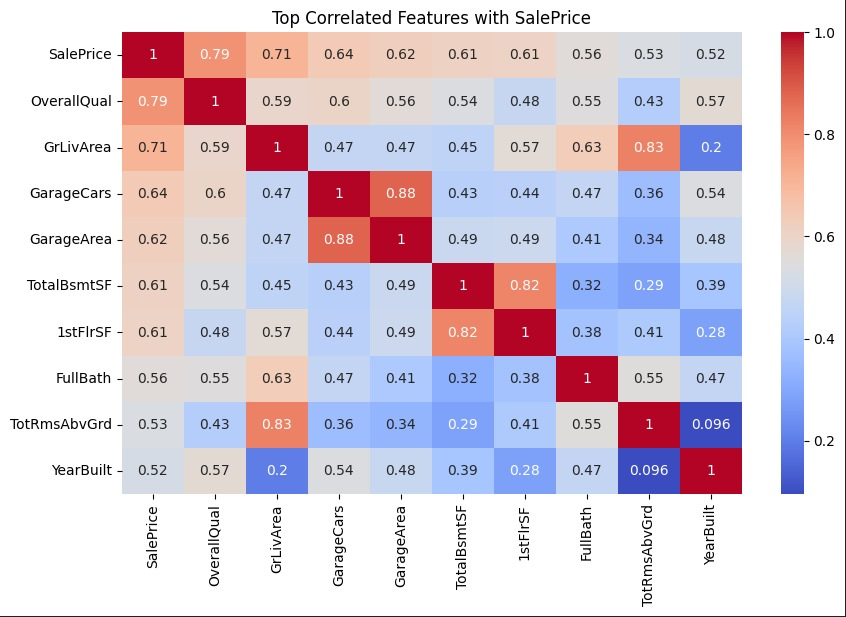

# 🏠 House Price Prediction 


## Project Overview
This project predicts house prices using the **Kaggle House Prices dataset**.  
It shows the full ML workflow:

- Load & explore data
- Clean & prepare features
- Train ML models
- Evaluate & save models

---

## 📂 Dataset
- **Dataset Name:** House Prices - Advanced Regression Techniques  
- **Source:** [Kaggle Link](https://www.kaggle.com/c/house-prices-advanced-regression-techniques)  

**Files:**

| File Name | Description |
|-----------|-------------|
| train.csv | Training data with features + target |
| test.csv  | Test data without target |

**Download Example:**

```bash
kaggle competitions download -c house-prices-advanced-regression-techniques
unzip house-prices-advanced-regression-techniques.zip -d house_prices
````

---

## 🛠️ Requirements

```bash
pip install numpy pandas matplotlib seaborn scikit-learn joblib xgboost
```

---

## Steps (Simple Version)

### 1. Load Data

```python
import pandas as pd
train = pd.read_csv("house_prices/train.csv")
test = pd.read_csv("house_prices/test.csv")
print(train.head())
```

### 2. Simple Feature Engineering

```python
train['TotalSF'] = train['TotalBsmtSF'] + train['1stFlrSF'] + train.get('2ndFlrSF', 0)
train['HouseAge'] = train['YrSold'] - train['YearBuilt']

features = ['LotArea','OverallQual','TotalSF','HouseAge']
X = train[features]
y = train['SalePrice']

```


### 3. Train-Test Split

```python
from sklearn.model_selection import train_test_split
X_train, X_val, y_train, y_val = train_test_split(X, y, test_size=0.2, random_state=42)
```

### 4. Train Simple Model

```python
from sklearn.linear_model import LinearRegression
model = LinearRegression()
model.fit(X_train, y_train)

preds = model.predict(X_val)
```

### 5. Evaluate Model

```python
from sklearn.metrics import mean_squared_error
import math

rmse = math.sqrt(mean_squared_error(y_val, preds))
print("RMSE:", rmse)
```

### 6. Train Better Model (Random Forest)

```python
from sklearn.ensemble import RandomForestRegressor
rf = RandomForestRegressor(n_estimators=100, random_state=42)
rf.fit(X_train, y_train)
preds_rf = rf.predict(X_val)
print("Random Forest RMSE:", math.sqrt(mean_squared_error(y_val, preds_rf)))
```

### 7. Save Model

```python
import joblib
joblib.dump(rf, "house_price_model.joblib")
```

### 8. Load Model & Predict

```python
loaded_model = joblib.load("house_price_model.joblib")
sample = X_val.iloc[0:1]
print("Predicted Price:", loaded_model.predict(sample)[0])
```

---

## Skills Learned

| Skill               | What it shows            |
| ------------------- | ------------------------ |
| Data cleaning       | Prepare numeric features |
| Feature engineering | TotalSF, HouseAge        |
| Linear Regression   | Simple baseline          |
| Random Forest       | Better model, non-linear |
| Model evaluation    | RMSE                     |
| Model saving        | joblib save & load       |

---

## Folder Structure

```
house-price-prediction/
├─ house_prices/            # dataset folder
├─ models/                  # saved model
│  └─ house_price_model.joblib
├─ notebooks/               # Jupyter notebooks
├─ README.md
└─ requirements.txt

